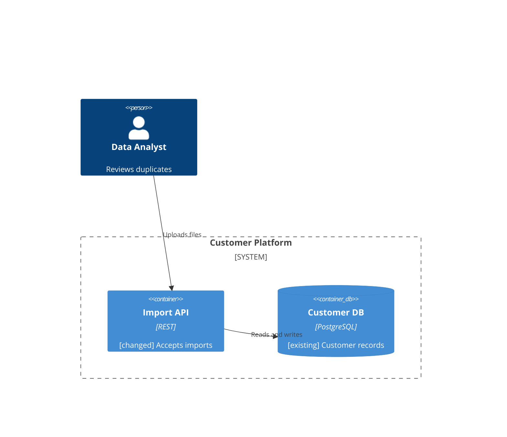
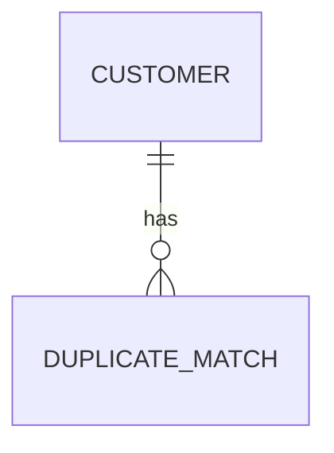

# Contract: story package and document format

What the helper reads and writes, precisely enough to implement and test. Rationale is in [research.md](../research.md); entity fields are in [data-model.md](../data-model.md).

## Package

```text
specs/<NNN>-<slug>/
├── s00-README.md            generated overview
├── s01-requirements.md … s08-completion.md
├── spec.md   -> s04-ai-spec.md      alias (symlink, else read-only mirror)
├── plan.md   -> s05-plan.md         alias
├── tasks.md  -> s06-tasks.md        alias
└── assets/                          exported artefact files, created by the first `artifact register`
```

- Exactly these document names. `s0`–`s8` are literal; the helper matches `^s0[0-8]-` and never a bare number (FR-070).
- `assets/` holds only files named by an `eil:artifact` record. Anything else there is reported as `orphan-asset`.
- An alias exists only while its target exists. No other alias is ever created (FR-049, FR-050).
- A directory is **governed** iff it contains `s00-README.md` (FR-069).

## Stage document layout

Each stage document is ordinary Markdown. The helper only interprets four things: **item lines**, **record blocks**, **marked regions** and **tags**.

### Marked regions

```markdown
<!-- eil:begin approval -->
```json
{ … }
```
<!-- eil:end approval -->
```

Region names: `approval`, `assessment`, `comprehension`. All three are **excluded from the fingerprint**. The begin and end markers each sit on their own line; nesting is not allowed. A document with an unmatched marker is reported as `malformed-region` and treated as changed.

### Record blocks (fingerprinted)

Challenges, overrides, abbreviation, artefact export and review-acceptance records are fenced JSON blocks whose info string starts `eil:` :

````markdown
```eil:challenge
{"id": "CH-002", "stage": "functional", "raised_by": "ai", "target": "FR-007",
 "text": "…", "status": "open"}
```
````

Info strings: `eil:challenge`, `eil:override`, `eil:abbreviation`, `eil:artifact`, `eil:review`. One JSON object per block. The helper rewrites a block in place when it changes state (for example closing a challenge) and preserves everything else byte for byte.

An `eil:review` record (`eil review accept`, D-28) is `{"id": "RVW-004", "stage": "functional", "unit": "item"|"section", "target": "FR-026"|"Business Rules", "by": "…", "at": "…", "note": "…"}` (`note` optional). It lives under a generated `## Reviews` heading, which — like `## Challenges`, `## Overrides`, `## Quality Assessment`, `## Comprehension Check` and `## Approval` — holds nothing but records and marked regions and so is never itself a "changed section" (`trace.ADMINISTRATIVE_SECTIONS`).

### Item lines

An item is defined by a line matching:

```text
^\s*(?:[-*]\s+)?\*\*(REQ|UC|FR|NFR|DEC|AIS|EVD|OQ|OVR|CH|ART)-(\d{3})\*\*\s*[:.]\s*(.+)$
```

and an optional trailing clause on the same line or continuation lines up to the next item or blank line:

```text
(traces: ID[, ID…])        upstream sources
(code: <sha>|PR#<n>[, …])  code changes (s06, s07 only)
(status: open|resolved|accepted)   OQ only
(material: yes|no)         OQ only; an OQ with no `material` clause counts as material
(accepted-by: <name>)      OQ only; required when a material OQ is `accepted` (FR-023)
(store: <label>)           ART of an ER diagram only: the data store it describes
(decided: CH-###|OQ-###|AIS-###|RVW-###)  text is a human's own words, copied verbatim from
                            that recorded decision (D-24) or from an `eil review` acceptance
                            (D-28); write it untagged instead of [ai-draft]
[ai-draft]                 unreviewed AI-authored item (D-16)
[pending-clarification]    AIS only (FR-067)
```

Rules the parser enforces and reports (never silently ignores):
- An ID defined twice in a story, or reused after removal → `duplicate-id`.
- A `traces:` reference to an ID that does not exist upstream → `dangling-trace`.
- A `decided:` clause whose value is not shaped `CH-###`, `OQ-###` or `AIS-###` → `malformed-item`; one whose id does not exist anywhere in the story, or exists but is not in an eligible state (a `CH` not `accepted`; an `OQ` not `resolved`/`accepted`; anything other than an `AIS` item) → `decided-source-invalid` (`provenance.decided_findings`, D-24). Both are integrity findings: they cannot be overridden, because unverifiable provenance is worse than an ordinary unmet criterion.
- A line that starts `**REQ-`, `**FR-` and so on but does not match the item grammar → `malformed-item` (R-5: parse failures are findings, not silent drops).
- Tasks in `s06` are Spec Kit task lines (`- [ ] T012 …`); the helper reads `T###` from them and the `traces:` clause from the same line.

### Definition location by stage

| Stage | Defines | Must reference |
|---|---|---|
| s01 | `REQ`, `UC`, `OQ`, `ART` (context) | none (`ART`: `REQ`/`UC`) |
| s02 | `FR`, `NFR`, `ART` (sequence, wireframe) | `REQ`/`UC` |
| s03 | `DEC`, `ART` (container, component, sequence, ER) | `FR`/`NFR` (`ART`: `FR`/`NFR`/`DEC`) |
| s04 | `AIS` | `REQ`/`FR`/`NFR`/`DEC`/`ART` |
| s05 | (sections only) | `DEC` in section headings via `(traces: …)` |
| s06 | `T###` | `AIS`/`DEC` |
| s07 | `EVD` and verification rows | `REQ`/`FR`/`ART`, task, code |
| s08 | none | summarises; no new items |

## Artefacts in documents

An artefact is an `ART` item line followed by exactly one **attachment**: a ` ```mermaid ` fence (inline form) or an ` ```eil:artifact ` block (file form). The attachment belongs to the nearest preceding `ART` line with no other item line between. Blank lines and a heading-free run of prose are allowed between them; another item line or a heading ends the association.

````markdown
**ART-003**: Container view of duplicate analysis (traces: FR-007, DEC-004)



**ART-009**: Customer duplicate data (traces: DEC-004) (store: Customer DB)



**ART-011**: Duplicate review screen (traces: FR-007, UC-002)

```eil:artifact
{"file": "assets/duplicate-review.png", "sha256": "sha256:…", "kind": "wireframe",
 "source": {"tool": "figma", "url": "https://www.figma.com/design/…?node-id=12-345",
            "exported_at": "2026-09-25", "exported_by": "Ada Dev"}}
```
````

**Kind derivation** (inline): first non-blank, non-comment line of the fence, after any leading `---` frontmatter block. `C4Context` → `c4-context`, `C4Container` → `c4-container`, `C4Component` → `c4-component`, `sequenceDiagram` → `sequence` (functional in s02, technical in s03), `erDiagram` → `er`. Anything else → `diagram-unparseable`. File form: the record's `kind`.

**Accepted Mermaid subset** (isolated in `diagrams.py`, pinned by fixtures; risk R-10):

| Diagram | Recognised constructs |
|---|---|
| C4 | Elements `Person`, `System`, `Container`, `Component`, each with optional `Db` or `Queue` and optional `_Ext` (for example `SystemQueue_Ext`, `ContainerDb_Ext`, `ComponentDb`); boundaries `Boundary`, `Enterprise_Boundary`, `System_Boundary`, `Container_Boundary`, each opening a `{` block closed by `}`; relations `Rel`, `BiRel`, `Rel_U`/`Rel_Up`, `Rel_D`/`Rel_Down`, `Rel_L`/`Rel_Left`, `Rel_R`/`Rel_Right`, `Rel_Back`, `RelIndex`. An element is `(alias, label, …)`; the label is the name and may be quoted or a bare word; `$name="value"` arguments are read and ignored except `$descr` and `$techn`. `C4Dynamic` and `C4Deployment` are outside the subset. |
| sequence | `participant A`, `participant A as Label`, `actor A as Label`, the configured form `participant A@{ … } as Label`, `create participant`/`create actor`, `destroy`; messages `A->>B: text` with the arrows `->>`, `-->>`, `->`, `-->`, `-x`, `--x`, `-)`, `--)`, `<<->>`, `<<-->>` and the `+`/`-` activation shorthand after the arrow; blocks `alt`/`opt`/`loop`/`par`/`critical`/`break`/`rect`/`box` closed by `end`, with `else`/`and`/`option`; `Note left of\|right of\|over X[,Y]: text`; `autonumber`, `activate`, `deactivate`, `title`. A participant used only in a message is implied, with its alias as its name. |
| ER | Entity blocks `NAME {` … `}` whose lines are `type name [PK\|FK\|UK …] ["comment"]`; entity aliases `id[Label]` and `id["Label"]`; a bare entity name; `:::class` suffixes; relationships `A [cardinality]--[cardinality] B : label` and the dotted form `..`, where a cardinality is two of `\|`, `o`, `{`, `}` (for example `\|\|--o{`); `direction`, `style`, `classDef`, `class`, and `subgraph` … `end`. Relationships written in words are outside the subset. |

Every diagram may begin with a `---` frontmatter block and `%%` comment lines. Element names come from the display label, so an alias that differs between diagrams is not a mismatch.

Constructs outside the subset are ignored only if they are known presentation directives (`title`, `UpdateElementStyle`/`updateElementStyle`, `UpdateRelStyle`, `UpdateLayoutConfig`, `style`, `classDef`, `direction`, frontmatter, comments `%%`); any other unrecognised line is reported as `diagram-unparseable` with its line number in the document, and so is a diagram with no recognisable elements. The subset was widened after reading the Mermaid documentation examples (fixtures in `tests/fixtures/mermaid`, `VERSION.md`).

**Named lists** read by the consistency rules: bullet lines under a heading whose text is `Users and Stakeholders`, `Dependencies` (s01) or `Actors` (s02); the name is the first bold span, else the text before `:` or ` — `. Names compare case-insensitively with whitespace collapsed.

**Findings** (reported by `check`, never silently dropped; each maps to the gate criterion of its stage):

| Code | Meaning |
|---|---|
| `artifact-unregistered` | a `mermaid` fence or `eil:artifact` block with no `ART` line, or an `ART` line with no attachment |
| `artifact-untraced` | an `ART` line with no `traces:` clause |
| `artifact-wrong-level` | kind not permitted in this stage, or a functional sequence diagram naming a non-actor (FR-081) |
| `diagram-unparseable` | no recognisable elements, or an unrecognised line (FR-080) |
| `diagram-inconsistent` | a FR-079 rule broke; the message names the rule (a–f in D-20) and the elements |
| `artifact-missing-file` | the record's `file` does not exist |
| `artifact-hash-mismatch` | the file's SHA-256 differs from the record (FR-078) |
| `artifact-no-provenance` | file form without `source.url`, `exported_at` or `exported_by`, or a Figma URL without `node-id=` (FR-077) |
| `artifact-format-not-allowed` | extension not in `png`, `svg`, `pdf`, `jpg`, `jpeg` |
| `artifact-changed-since-approval` | item hash differs from the owning stage's approval (FR-082) |
| `artifact-uncovered` | in scope in `s04` but reached by no task (FR-083) |
| `orphan-asset` | a file in `assets/` named by no record |

## Approval record (inside the `approval` region)

```json
{
  "stage": "functional",
  "by": "Ada Lovelace",
  "at": "2026-09-25T10:14:03Z",
  "fingerprint": "sha256:9f2c…",
  "attestation": "Yes, this is the behaviour we require. Played back to Sam and Priya on 24 Sep.",
  "played_back_to": "Sam (business), Priya (QA)",
  "upstream": {"requirements": "sha256:41ab…"},
  "items": {"FR-001": "sha256:…", "FR-002": "sha256:…"},
  "section_fingerprints": {"Business Rules": "sha256:7ac1…", "Acceptance Criteria": "sha256:…"},
  "upstream_items": {"REQ-001": "sha256:…", "UC-001": "sha256:…"},
  "overrides_used": ["OVR-001"],
  "comprehension": {"understood": 3, "coached": 1, "revealed": 0, "skipped": 1, "not_applicable": 0}
}
```

- `section_fingerprints`: one fingerprint per level-2 (`##`) section, with every item's lines, every attached Mermaid fence's lines, every marked region's lines, and every `eil:` record block's lines blanked out (`trace.section_fingerprints`), keyed by the section's current title. A section that holds nothing but record blocks and marked regions (`Reviews`, `Challenges`, `Overrides`, `Quality Assessment`, `Comprehension Check`, `Approval`) is never included: recording a challenge, override or review, or checking a gate, is never itself a "changed section." `eil amend`/`eil review finish` refuse when a section outside any item changed with no matching `eil review` acceptance (D-25, D-28).
- `upstream_items`: the current hash, at approval time, of every id this stage's own items trace to, directly or not, anywhere upstream (`impact.upstream_item_hashes`). A later `check`/`status` compares each against its **current** hash to decide `needs-re-review`, per item, regardless of how many times the upstream stage has itself been re-approved since (D-26). An approval recorded before this field existed carries none; a later check then falls back to the whole-document `upstream` fingerprints.
- An amendment (`eil amend`) additionally carries `"amended": true` and `"amends": ["CH-004", …]`, the cited human decisions (`CH`, `OQ`, `AIS` or `RVW`), alongside the same fields above. A guided review's re-approval (`eil review finish`) instead carries `"reviewed_change_by_change": true` and `"reviewed_ids": ["RVW-004", …]` — every `eil:review` acceptance it rests on (D-28).

Absent region or empty JSON ⇒ no approval. Unparseable JSON ⇒ `malformed-approval`, treated as no approval and reported.

## Assessment record (inside the `assessment` region)

```json
{
  "stage": "functional",
  "evaluated_at": "2026-09-25T10:02:41Z",
  "fingerprint": "sha256:9f2c…",
  "criteria": [
    {"id": "FUN-G03", "kind": "traceability", "status": "not-met",
     "reason": "FR-009 traces to no requirement or use case"},
    {"id": "FUN-G09", "kind": "judgment", "status": "met",
     "reason": "AI assessment: all acceptance criteria are observable",
     "basis": "sha256:2b91…"}
  ],
  "assessment": {"ambiguity": [], "missing": [], "contradictions": [],
                 "unsupported_assumptions": [], "untestable": []},
  "findings": [{"code": "dangling-trace", "where": "FR-014", "message": "…"}]
}
```

`basis` is present only for a `judgment` criterion: the fingerprint of exactly the sections it reads (its `headings`, joined and re-hashed from `trace.section_fingerprints`), or the whole-document fingerprint for the few judgment criteria with no named sections (they judge the whole document, for example REQ-G12/FUN-G12). A later `check` keeps that verdict only while its own `basis` still matches — an edit to a section the criterion never reads does not void it, unlike the document-level fingerprint every other criterion is still checked against (D-29). A record with no `basis` (from before this decision) is never treated as current.

The assessment carries the `fingerprint` of the document version it evaluated. A stage is `in-review` only while that equals the document's current fingerprint and every criterion is `met` or `overridden`; after any content change the assessment is stale and the stage is a `draft` again until `check` is re-run.

## Comprehension record (inside the `comprehension` region, `functional` and `technical` only)

```json
{
  "stage": "functional",
  "fingerprint": "sha256:9f2c…",
  "taken_by": "Ada Lovelace",
  "started_at": "2026-09-25T09:41:10Z",
  "updated_at": "2026-09-25T09:58:33Z",
  "levels": [
    {"level": "recognise", "outcome": "understood", "attempts": 1, "items": ["FR-003"]},
    {"level": "explain",   "outcome": "coached",    "attempts": 3, "items": ["FR-007"]},
    {"level": "apply",     "outcome": "skipped",    "attempts": 1, "items": ["FR-009", "FR-012"]},
    {"level": "trace",     "outcome": "revealed",   "attempts": 2, "items": ["REQ-003", "FR-007", "ART-011"]},
    {"level": "evaluate",  "outcome": "not-applicable", "reason": "one-screen story, no trade-off", "attempts": 0, "items": []}
  ]
}
```

Rules:
- **Allowed keys only.** `levels[].level` is one of `recognise`, `explain`, `apply`, `trace`, `evaluate`; `outcome` is one of `understood`, `coached`, `revealed`, `skipped`, `not-applicable`; `reason` only with `not-applicable` and then required. No key holds a question, an answer, a hint or a score, and the writer rejects any other key (FR-092).
- `items` are ids that exist in the document or its approved upstream, listing every item asked about across attempts.
- **Current** ⇔ `fingerprint` equals the document's current fingerprint (formatting-only differences ignored, FR-044). A record for a different fingerprint is **stale**; the next `comprehension record` replaces it whole rather than merging.
- **Complete** ⇔ current and all five levels present, each with any outcome (FR-093). Passing is not required.
- A region that holds unparseable JSON or any key outside the allowed set is `malformed-comprehension`: reported, and treated as no record (like `malformed-approval`).
- `check` reports `comprehension-missing` (no record), `comprehension-stale` (record for another fingerprint) or `comprehension-incomplete` (fewer than five levels), each as the reason `FUN-G16` or `TEC-G19` is not met.
- Summary counts (`understood`, `coached`, `revealed`, `skipped`, `not_applicable`) are derived and copied into the approval record's `comprehension` field.

### Technical decision fields (FR-032, FR-033)

A `DEC` item is its defining line followed by labelled fields, one label per line (bullets, `**bold**` and `Label:` or `**Label:**` are all accepted), the value on the same line or on the lines after it:

```markdown
**DEC-004**: Use asynchronous processing (traces: FR-007, NFR-002)
Decision: Customer duplicate analysis runs asynchronously in a worker.
Reason: The analysis may exceed the synchronous API latency requirement.
Rejected alternative: Analyse inside the import request.
Trade-off: Results are not immediately available to the caller.
Owner: Ada Dev
```

The labels are `Decision`, `Reason`, `Rejected alternative` (also `Rejected alternatives`), `Trade-off` and `Owner`, matched case-insensitively. Unlike other items, a `DEC` continues over blank lines when the next text is another field, or the value of a label whose value is still empty, so the standard's own layout (a blank line between fields) parses. It ends at the next heading, item line or task line. Every field is part of the item's text and therefore of its hash and of the document fingerprint. `TEC-G02` reports each missing or empty field by name (`DEC-004 has no reason`), an `Owner` that names the AI (`identity.is_ai_actor`, attestation-level like FR-012), and a `DEC` whose `traces:` names no `FR` or `NFR`.

### Verification rows and completion lines (FR-059 to FR-065, FR-084)

A verification row is an `EVD` item that traces to what it verifies (a `REQ`, `FR`, `NFR`, `ART`, task id or code) and carries `(status: verified|failed|unverified|excepted)` and optionally `(code: sha|PR#n)`, followed by labelled lines `Kind` (`automated` or `manual`), `Evidence`, and for an exception `Accepted by` and `Reason` (same label rules as decision fields, but a row ends at the first blank line). A verified or failed row needs `Kind` and `Evidence`; an excepted row needs `Accepted by` (a person, never the AI) and `Reason`. A row covers every id it traces to; a target takes the worst status of its rows (`failed` > `unverified` > `excepted` > `verified`); a target with no row is `unverified`; an excepted row missing who or why counts as `unverified`. A task id (`T012`) is a valid trace target, so evidence can trace to a task.

`s07` sections: `Automated Evidence`, `Manual Evidence`, `Exceptions`, `Open Tasks` (required), and optionally `Failed Evidence` and `Acceptance Criteria`. Every task of `s06` that is not done must be named (by id) under `Open Tasks`. The document must not say the story is complete (`VER-G06`: a `Completion` heading, or a sentence such as "the story is complete", or an approval record).

`s08` `Diagram Currency` has one line per approved `ART`: `- ART-004: current`, or `- ART-007: deviation, accepted by NAME, because REASON`; a deviation is also named under `Accepted Deviations`. Approved means the owning stage's approval is current.

### Question targets (deterministic selection, FR-089)

`comprehension plan` chooses, for level *L* and attempt *k* (default 1), one target from the eligible ids, sorted ascending: index = `int(sha256(f"{fingerprint}|{L}|{k}")[:8], 16) mod len(eligible)`. An id already chosen for an earlier level in the same plan is skipped, unless nothing else is eligible.

| Level | s02 eligible | s03 eligible |
|---|---|---|
| recognise | `FR`, `NFR`, `UC` | `DEC`, `ART` |
| explain | `FR`, `NFR` | `DEC` |
| apply | `FR`, `UC` | `DEC`, `ART` (sequence, container) |
| trace | any item with ≥ 1 `traces:`; the target is the item **and** its full upstream chain to a `REQ`/`UC`, plus any `ART` tracing to it | as s02, chain to `REQ` through `FR` |
| evaluate | `NFR`, `FR` with a stated rule or limit | `DEC` (its trade-off and rejected alternative) |

A level with an empty eligible set is reported as `no-material`, and the agent records it `not-applicable` with that reason. The agent phrases the question; it may not choose a different target.

Criterion ids are `<STAGE3>-G<nn>` where `STAGE3` is `REQ`, `FUN`, `TEC`, `AIS`, `PLN`, `TSK`, `VER`, `CMP`, in template order.

## Fingerprint algorithm (normative)

Input: a file's bytes. Output: `sha256:` + 64 lowercase hex digits.

1. Decode UTF-8; on failure, report `not-utf8` (exit 2) — no fingerprint.
2. Replace `\r\n` and lone `\r` with `\n`.
3. Remove every region delimited by `<!-- eil:begin approval -->` … `<!-- eil:end approval -->`, `<!-- eil:begin assessment -->` … `<!-- eil:end assessment -->` and `<!-- eil:begin comprehension -->` … `<!-- eil:end comprehension -->`, **including** the marker lines and any single blank line directly after the end marker. (The `## Approval`, `## Quality Assessment` and `## Comprehension Check` headings remain.)
4. Remove every literal `[ai-draft]` tag, and one preceding space if there is one, **except inside an HTML comment**. Reviewing and untagging a human's own words is not a content change (research D-23); this matches the item hash below, which already excludes the tag. A real tag is only ever written on live text, never inside a comment: the shipped templates' own instructional comments say the word without it ever being a tag on anything (for example `<!-- Tag any text the AI wrote with [ai-draft] until a human has reviewed it. -->`), and that mention MUST keep counting as ordinary content. `[pending-clarification]` is **not** removed here: clearing it is a human decision made through `eil resolve`, not a formatting no-op.
5. Strip trailing spaces and tabs from every line.
6. Collapse every run of two or more blank lines into one blank line.
7. Strip all leading and trailing blank lines.
8. Append a single `\n`, encode UTF-8, SHA-256.

**Test vectors** (the unit suite carries these): `"A\n\nB\n"`, `"A\r\n\r\nB"`, `"A  \n\n\n\nB\n\n"` must produce **one** identical fingerprint; `"A\nB\n"` (blank line removed) and `"A \n\nB2\n"` must each produce a different one; a file that differs only inside an approval, assessment or comprehension region must match the same file without that region; `"**REQ-001**: text [ai-draft]\n"` must match `"**REQ-001**: text\n"`, but `"**AIS-001**: text [pending-clarification]\n"` must **not** match `"**AIS-001**: text\n"`; a document whose only mention of `[ai-draft]` is inside an HTML comment (such as the templates' own header) must be a true no-op for this step — not merely equal to some other variant, but byte-for-byte unaffected by it.

Because `eil approve` already refuses while any `[ai-draft]` tag remains (`unreviewed-ai-content`), an already-approved document's *item* content never had the tag in its hashed text. **The templates' own header comment mentions the word too, though, and that is not a tag**: an earlier version of this step stripped the substring unconditionally and so moved every stage document's fingerprint on upgrade, with nothing actually edited (found via dogfooding). Scoping the removal to outside a comment closes that gap; no migration or version flag is needed beyond it. Only an `assessment` or `comprehension` record taken while a *real* tag still remained on the document can go stale across an upgrade; that is cheap to retake and never blocks an approval.

## Item hash (for impact analysis)

`sha256:` of the item's normalised text: its defining line plus continuation lines (for an `ART`, also its attachment: the Mermaid fence text, or the `eil:artifact` record, which carries the file's fingerprint), with the `traces:` and `decided:` clauses **included**, the tags `[ai-draft]`/`[pending-clarification]` excluded, whitespace normalised as steps 2, 5, 6 above. An upstream item's hash changing means every downstream item that lists it in `traces:` is reported as affected (FR-043).

## Overview grammar (`s00-README.md`)

Generated only. First line: `<!-- eil:generated — edit the stage documents, not this file -->`. Sections in fixed order: **Story** (title, owner), **Status** (current stage, overall status), **Documents** (nine rows: link, derived state), **Artefacts** (one row per `ART`: id, kind, owning stage, derived state, link; or "none"), **Approvals** (stage, by, at, short fingerprint, and for `functional` and `technical` the comprehension counts, for example `understood 3 · coached 1 · skipped 1`), **Outstanding** (open questions, open challenges, pending clarifications, overrides, issues), **Accepted risks** (accepted open questions), **Abbreviated stages**, **Mirrors** (each alias that is a mirror, or "none"). Only record values and fixed labels appear; no text is copied from a document's prose (FR-055). An artefact row shows its id, kind and a link, and the item line's title is a label copied verbatim, never diagram content.

## Templates (contract with the preset)

Each template contains the stage's required content headings (FR-014..017, 059..063), an empty Challenges, Overrides, Quality Assessment and Approval section, and a comment line naming the stage's gate. Headings are the names in the process standard so a reader and the gate share vocabulary. Templates also carry the stage's artefact section (s01 `System Context`; s02 `Sequence Diagrams` and `Wireframes`; s03 `Container View`, `Component Views`, `Sequence Diagrams` and `Data Model`; s04 `Artefacts in Scope`; s07 an artefact row group; s08 `Diagram Currency`), each with an example `ART` item and attachment as a comment, so a section that does not apply is removed with a reason like any other (FR-018, FR-075). A section not applicable to a story is removed only with a one-line reason under a `## Not applicable` heading (FR-018); the gate reports required headings that are neither present nor listed there.

## Feature 002 amendments (proportionate revalidation)

Folded in from `specs/002-proportionate-revalidation/contracts/document-format.md` in the same change as the tests that pin
them. Where a row or rule below differs from the text above, this section governs. The 002 delta file is kept
as the record of the change.

### Marked regions

Region names become `approval`, `assessment`, `comprehension`, `provenance`, `changelog`. **All five are excluded from the fingerprint** (algorithm step 3 gains the two new names) and from `section_fingerprints`. `provenance` and `approval` hold one JSON object in a ` ```json ` fence. `changelog` holds a generated Markdown table and is never parsed, only rewritten from `provenance.changes`.

`ADMINISTRATIVE_SECTIONS` gains `Change Log` and `Record`. Both headings are placed by the helper (on first write, D-42): `## Change Log` just before `## Record`, and `## Record` just before `## Comprehension Check` or `## Quality Assessment`, whichever comes first.

### Content blocks (FR-039)

Walk the document outside marked regions, `eil:` record blocks, HTML comments and administrative sections:

1. A heading line ends the current block and is not a block. The current `##` title becomes the section of the blocks after it.
2. An item line (the 001 item grammar, now including `RF`), a task line or a plan heading carrying `(traces: …)` starts a numbered block. It continues over its continuation lines by the 001 rules, including the DEC and EVD field rules and an `ART` item's attachment.
3. A fenced block (```` ``` ```` or `~~~`) not attached to an `ART` is one block. So is a table (a run of lines starting with `|`).
4. Any other run of non-blank lines is one block.

**Block hash**: the text of the block with `[ai-draft]` and `[pending-clarification]` removed, then fingerprint steps 2, 5 and 6, then `sha256:`. For a numbered item it equals the 001 item hash, so existing `items` and `upstream_items` snapshots stay comparable.

**Key**: the id for numbered blocks; `§` plus the heading text (without the `(traces:)` clause) for plan sections; otherwise `<section>#<first 12 hex digits of the hash>`.

### Clauses (extended)

- `(traces: ID[, ID…])` may end a **prose block** as well as an item. It is the block's citation for the restated class (D-32). Only the last line of the block is read for it.
- The item kinds regex gains `RF`: `^\s*(?:[-*]\s+)?\*\*(REQ|UC|FR|NFR|DEC|AIS|EVD|OQ|OVR|CH|ART|RF)-(\d{3})\*\*…`
- `RF` items take `(status: open|resolved|excepted)` and the labelled lines `Root`, `Accepted by` and `Reason`.
- `[ai-draft]` is written and removed **only by the helper** (D-33). Its presence is never read as status.
- `(decided: …)` also accepts `CR-###` (the 001 grammar `CH|OQ|AIS|RVW` gains `CR`). It is eligible only when that correction's `item` is this item and it has a `wording`, and the item's text equals the wording: the item's text after its `**ID**:` prefix, with its clauses and tags removed, compared with the wording, both normalised as fingerprint steps 2, 5 and 6. Otherwise `decided-source-invalid` (D-38). **This changes the 001 integrity rule for `CR` clauses only**: a `CR-###` that exists but whose wording is absent or differs from the item's text is a non-blocking finding. The change is uncovered and goes on the `changes` list (or, in a never-approved stage, the item is inferred and goes on the `inferred` list), and `check` does not fail on it. A `CR-###` that does not exist, and every `CH`/`OQ`/`AIS`/`RVW` case, remains an integrity finding as in 001. A later edit to the item replaces or removes the clause: the AI does this when it edits the item (Tier 2, contract test `test_decided_clause_removed_on_reedit`), and the helper reports a clause left behind with the same non-blocking finding.

### Provenance region

```json
{
  "version": 1,
  "currency": "known",
  "blocks": {
    "AIS-007": {"hash": "sha256:…", "class": "inferred", "adds": "retry policy of 3 attempts",
                "reviewed": {"by": "Ada Dev", "at": "…", "list": "RVW-012", "reply": "ok to all"},
                "sources": {"DEC-002": "sha256:…"}},
    "Background#3f2a91c0d4e1": {"hash": "sha256:…", "class": "restated", "cites": {"REQ-001": "sha256:…"}},
    "T014": {"hash": "sha256:…", "class": "inferred", "sources": {"AIS-011": "sha256:…"},
             "completed_against": {"AIS-011": "sha256:…"}, "blocked_at_completion": false}
  },
  "acceptances": [{"id": "RVW-012", "stage": "ai-spec", "kind": "inferred", "digest": "sha256:…", "by": "…", "at": "…",
                   "reply": "…", "accepted": [], "except": [], "questioned": [], "reopened": [], "reason": null}],
  "corrections": [{"id": "CR-003", "item": "FR-004", "owner": "functional",
                   "found_in": {"stage": "implementation", "item": "T014"}, "problem": "…", "wording": "…",
                   "impact": [], "opened_by": "…", "at": "…", "status": "open", "closed_by": null, "closed_at": null, "closed_by_approval": null}],
  "changes": [{"at": "…", "item": "FR-004", "summary": "…", "summary_by": "ai", "origin": "CR-003", "accepted_by": "…"}]
}
```

**Allowed keys only**. The complete set:

| Object | Allowed keys |
|---|---|
| Top level | `version`, `currency`, `blocks`, `acceptances`, `corrections`, `changes`, `conflicts` |
| Block (`blocks.<key>`) | `hash`, `class`, `cites`, `adds`, `reviewed`, `sources`, `completed_against`, `blocked_at_completion`, `basis` |
| `reviewed` | `by`, `at`, `list`, `reply` |
| Acceptance | `id`, `stage`, `kind`, `digest`, `by`, `at`, `reply`, `accepted`, `except`, `questioned`, `reopened`, `deferred`, `reason`, `resolved_conflict`, `hashes` (`{key: current hash}` of every entry the answer names, so a conflict is judged at the same content hash, FR-050) |
| Correction | `id`, `item`, `owner`, `found_in` (`stage`, `item`), `problem`, `wording`, `impact`, `opened_by`, `at`, `status`, `closed_by`, `closed_at`, `closed_by_approval` (absent on a stage nobody approves) |
| Change | `at`, `item`, `summary`, `summary_by`, `origin`, `accepted_by` |
| Conflict | `key`, `hash`, `answers` |

`class` ∈ `restated`, `decided`, `inferred`, `adopted`. An adopted block also carries `"basis": "approval <by> <at>" | "untagged before upgrade"`. Any other key, or unparseable JSON, is `malformed-provenance`: reported, and the region is treated as absent for status (everything needs review) but **not** rewritten by adoption. A person must repair or remove it, so a bad region never silently becomes "all adopted".

`conflicts` holds `[{"key", "hash", "answers": [RVW ids]}]` (FR-050).

`CR` and `RVW` numbers are story-wide sequences, allocated by the highest number found in any document's region (and, for `RVW`, any legacy `eil:review` block).

### Change Log region

```markdown
### Change Log
<!-- eil:begin changelog -->
| Date | Item | Change (AI-drafted, accepted as shown) | Found in | Accepted by |
|---|---|---|---|---|
| 2026-10-02 | FR-004 | Duplicate threshold is per tenant, not global | implementation (T014), CR-003 | Ada Dev |
<!-- eil:end changelog -->
```

The region is empty (markers only) until the first entry. In an approvable stage (requirements, functional, technical, completion) an entry is written for each change accepted when the stage is re-signed after its first approval. In a never-approved stage (ai-spec, plan, tasks, verification) an entry is written only when a correction owned by it closes (D-38); re-derivations there are recorded by git alone. The Change column is labelled as AI-drafted because every summary is written by the AI (`summary_by: "ai"`, Constitution II) and accepted as shown on the list the person answered. Cells are escaped (`|` → `\|`, newlines → space).

### Approval record (extended)

Adds `reached`, `rests_on`, `sign_off`, `outstanding`, `blocks` and, for completion, `review_findings` (see [data-model.md](../data-model.md)). A carried-forward approval has `sign_off` and no `attestation`. Every other approval has `attestation`, as today.

### Challenge record (extended)

Adds `severity` and `severity_history`. The duplicate rule is unchanged.

### s07 Verification (extended)

A new optional section, `## Review Findings`, holding `RF` items. `VER-G07`: no `RF` is `open`. An `RF` with `Root:` naming an upstream id must name a `CR` in a `(traces: CR-###)` clause once one is opened. The row grammar for `EVD` is unchanged. Automated evidence is **confirmable** when its `Evidence` line contains a `path::name` token, or a repository path plus a name, resolving to a file inside the project root (D-41).

### s08 Completion (changed wording only)

`Diagram Currency` needs a line only for **touched** artefacts (D-41). Untouched ones are listed on one line, `- untouched: ART-001, ART-002, …`. A deviation line remains possible and needs its reason.

### Fingerprint test vectors (added)

- A document that differs only inside a `provenance` or `changelog` region matches the same document without it.
- A document whose only difference is `[ai-draft]` added to or removed from a prose block matches (existing D-23 behaviour, now on every block kind).
